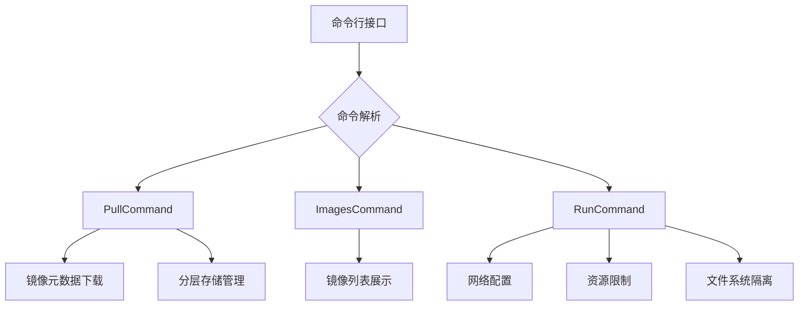

# Mocker - 轻量级容器实现教学项目
> 原项目：https://github.com/tonybaloney/mocker?tab=readme-ov-file


## 目录
- [项目概述](#项目概述)
- [功能特性](#功能特性)
- [快速开始](#快速开始)
- [架构设计](#架构设计)
- [开发指南](#开发指南)
- [许可协议](#许可协议)

## 项目概述
本项目是一个用于教学目的的轻量级容器实现，演示容器核心技术的实现原理。通过以下关键功能展示容器底层技术：

- **镜像管理**：实现Docker镜像的拉取、存储和版本控制
- **资源隔离**：利用Linux内核特性实现：
  - 网络隔离（Network namespace）
  - 资源限制（cgroups）
  - 文件系统隔离（chroot）
- **进程管理**：容器生命周期控制与进程监控

## 功能特性
### 核心命令
```bash
mocker pull <镜像名>[:标签]  # 从Docker Hub拉取镜像
mocker images               # 列出本地存储的镜像
mocker run <镜像> <命令>     # 启动容器并执行命令
```

### 技术特性
- 基于Linux命名空间的资源隔离
- 使用cgroups实现资源配额管理
- 镜像分层存储机制
- 终端友好的彩色输出
- 自动依赖检查与错误处理

## 快速开始
### 环境要求
- 操作系统：Linux (推荐 Ubuntu 20.04+)
- Python版本：3.7+
- 依赖工具：
  - `cgroups` 工具集
  - `iproute2` 网络工具
  - `nsenter` 命名空间工具

### 安装步骤
```bash
# 克隆项目
git clone https://github.com/yourusername/mocker.git
cd mocker

# 安装依赖
pip install -r requirements.txt

# 安装到系统路径
python setup.py install
```

### 基本使用
```bash
# 拉取Ubuntu镜像
mocker pull ubuntu:20.04

# 列出已下载镜像
mocker images

# 运行容器执行命令
mocker run ubuntu:20.04 /bin/sh -c "apt update && apt install -y curl"
```

## 架构设计
### 系统架构图


### 核心模块
| 模块          | 功能描述                     |
|---------------|------------------------------|
| base.py       | 命令基类与通用逻辑           |
| pull.py       | 镜像下载与校验               |
| images.py     | 镜像元数据管理与展示         |
| run.py        | 容器运行时管理与资源隔离     |

## 开发指南
### 项目结构
```text
mocker/
├── __init__.py     # 包配置与日志系统
├── base.py         # 抽象命令基类
├── pull.py         # 镜像拉取实现
├── images.py       # 镜像列表管理
├── run.py          # 容器运行时实现
scripts/
└── mocker          # CLI入口脚本
```

### 调试运行
```bash
# 开发模式安装
pip install -e .

# 运行测试
mocker run ubuntu:20.04 /bin/ls
```

## 许可协议
本项目基于 [MIT License](LICENSE) 开源，详情参见许可证文件。
