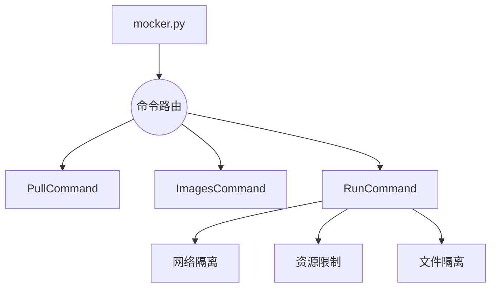
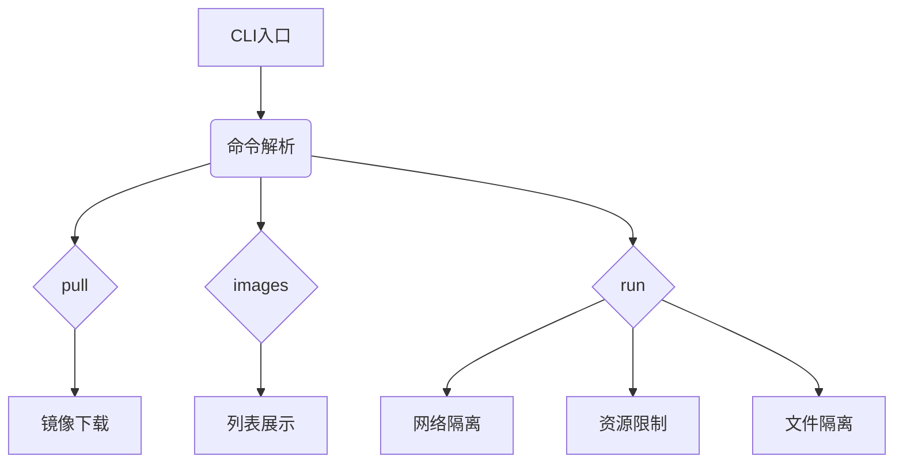

# Mocker - 轻量级Docker实现教学项目


## 项目概述
一个用于演示容器核心技术的教学项目，实现以下Docker核心功能：
- 镜像拉取与管理
- 容器网络隔离（Network namespace）
- 资源限制（cgroups）
- 文件系统隔离（chroot）

## 功能特性
- `mocker pull` - 从Docker Hub拉取镜像
- `mocker images` - 列出本地镜像
- `mocker run` - 运行容器实例

## 快速开始

### 环境要求
- Python 3.7+
- Linux系统（推荐Ubuntu 20.04+）
- root权限（部分功能需要）

### 安装步骤
```bash
# 安装依赖及项目
pip install .

# 验证安装
mocker --version
```

### 使用示例
```bash
# 拉取指定版本镜像
mocker pull ubuntu:20.04

# 列出所有镜像（显示名称、版本、大小）
mocker images

# 运行容器并执行命令
mocker run ubuntu:20.04 /bin/sh -c "echo 'Hello Mocker!'"

# 查看运行中容器
ps aux | grep mocker
```

### 注意事项
1. 首次运行会自动创建 ~/mocker 存储目录
2. 需要root权限执行网络相关操作
3. 可使用--help查看详细参数
```
# Mocker - 轻量级Docker实现教学项目


## 项目概述
一个用于演示容器核心技术的教学项目，实现以下Docker核心功能：
- 镜像拉取与管理
- 容器网络隔离（Network namespace）
- 资源限制（cgroups）
- 文件系统隔离（chroot）

## 功能特性
- `mocker pull` - 从Docker Hub拉取镜像
- `mocker images` - 列出本地镜像
- `mocker run` - 运行容器实例

## 快速开始

### 安装依赖
```bash
pip install -r requirements.txt
python setup.py install
```

### 使用示例
```bash
# 拉取Ubuntu镜像
mocker pull ubuntu:latest

# 列出本地镜像
mocker images

# 运行容器
mocker run ubuntu:latest /bin/bash
```

## 实现原理

### 架构设计


### 核心技术
1. **网络隔离**
   - 使用`pyroute2`创建虚拟网卡和网络命名空间
   - 通过Linux bridge连接容器与宿主机网络

2. **资源限制**
   - 利用cgroups限制CPU和内存使用
   - 用户级cgroups配置管理

3. **文件系统**
   - 镜像分层存储（JSON元数据 + 分层tar包）
   - 使用`chroot`实现文件系统隔离

## 开发指南

### 项目结构
```
.
├── mocker/               # 核心实现模块
│   ├── __init__.py      # 项目元数据及日志配置
│   ├── base.py          # 命令基类定义
│   ├── images.py        # 镜像管理实现
│   ├── pull.py          # 镜像拉取实现  
│   ├── run.py           # 容器运行实现
│   └── mocker          # CLI入口符号链接
├── scripts/            # 辅助脚本
│   └── mocker          # 启动脚本
├── requirements.txt    # 依赖清单
├── setup.py            # 安装配置
└── README.md           # 项目文档
```

### 架构流程图

